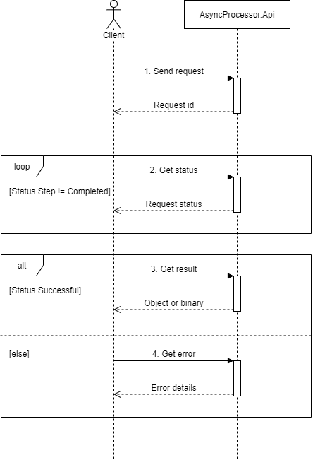

# MyLab.AsyncProcessor
SDK: [](https://www.nuget.org/packages/MyLab.AsyncProcessor.Sdk)

Docker образ: [](https://hub.docker.com/r/ozzyext/mylab-async-proc-api)

Спецификация API: [](https://app.swaggerhub.com/apis/ozzy/my-lab_async_processor_api/1)

```
Поддерживаемые платформы: .NET Core 3.1+
```
Ознакомьтесь с последними изменениями в [журнале изменений](/changelog.md).

## Обзор

`MyLab.AsyncProcessor` - платформа для разработки асинхронных обработчиков запросов с использованием микросервисной архитектуры.


Архитектура асинхронного процессора подразумевает, что:

* взаимодействие происходит через `API`
* обработка запроса происходит в обработчике запросов бизнес-логики `BizProc`
* `BizProc`получает запросы по событийной модели
* `API` и `BizProc`могут быть масштабированы 

На диаграмме ниже изображено взаимодествие клиента с асинхронным процессором через `API`:



## Внутри


Основные компоненты асинхронного процессора:

* `API` - обрабатывает входящие служебные запросы для подачи бизнес-запроса на обработку, получения статуса обработки, а также для получения результатов обработки;
* `BizProc` - бизнес-процессор. Выполняет обрабтку поступившего бизнес-запроса в соответствии со специической логикой;
* `Redis` - используется для временного хранения состояния выполнения запроса и информации о результате его выполнения;
* `RabbitMQ` - используется для организации событийной модели при передаче запросов от `API` к `BizProc`.

Особенности взаимодействия компонентов:

* `API` передаёт бизнес-запрос на обработку через очередь;
* `BizProc` сообщает об изменении состояния обработки запроса напряму в `API`;
* `API` хранит состояние обработки запроса и результаты в `Redis`;
* обработка бизнес-запроса не обязательно должна выполняться в один поток в пределах `BizProc`. Но `BizProc`  ответственнен за начало этой обработки.

### Жизнь запроса


### Статус запроса

Статус запроса содержит следующие параметры:

* `processStep` - этап жизни запроса:
  * `pending`
  * `processing`
  * `completed`
* `bizStep` - этап обработки в терминах бизнес-процесса. Перечень значений зависит от конуретной предметной области;
* `successful`- флаг, указывающий фактор успешности обработки зпроса на шаге `Completed`. Если `false` - в процессе обработки, возникла ошибка, при этом должно быть заполнено поле `error`;
* `error` - содержит информацию об ошибке, возникшей в процессе обработки запроса;
  * `bizMgs` - сообщение бизнес-уровня, понятное пользователю;
  * `techMgs` - техническое сообщение. Обычно, сообщение из исключения;
  * `techInfo` - развёрнутое техническое описание ошибки. Обычно - stacktrace исключения;
* `resultSize` - размер результата обработки запроса;
* `resultMime` - `MIME` тип результата обработки запроса.

Подробнее - [тут](https://app.swaggerhub.com/apis/ozzy/my-lab_async_processor_api/1#/RequestStatus).

### Бизнес-шаг обработки (BizStep)

`BizStep` пердназначен для того, чтобы детализировать этапы обработки запроса, специфичные для конкретной задачи. Эти шаги устанавливаются только в процессе обработки запроса, т.е. в то время, когда `processStep == processing`.

