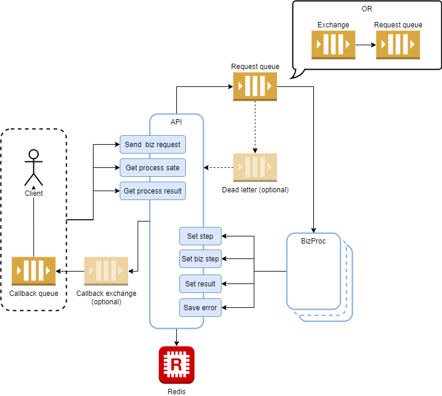
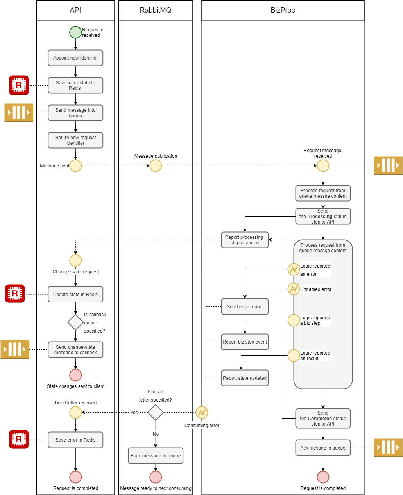

# MyLab.AsyncProcessor
SDK: [](https://www.nuget.org/packages/MyLab.AsyncProcessor.Sdk)

Docker образ: [](https://hub.docker.com/r/ozzyext/mylab-async-proc-api)

Спецификация API: [](https://app.swaggerhub.com/apis/ozzy/my-lab_async_processor_api/1)

```
Поддерживаемые платформы: .NET Core 3.1+
```
Ознакомьтесь с последними изменениями в [журнале изменений](/changelog.md).

## Обзор

`MyLab.AsyncProcessor` - платформа для разработки асинхронных обработчиков запросов с использованием микросервисной архитектуры.


Архитектура асинхронного процессора подразумевает, что:

* взаимодействие происходит через `API`
* обработка запроса происходит в обработчике запросов бизнес-логики `BizProc`
* `BizProc`получает запросы по событийной модели
* `API` и `BizProc`могут быть масштабированы 

На диаграмме ниже изображено взаимодествие клиента с асинхронным процессором через `API`:


## Внутри



Основные компоненты асинхронного процессора:

* `API` - обрабатывает входящие служебные запросы для подачи бизнес-запроса на обработку, получения статуса обработки, а также для получения результатов обработки;
* `BizProc` - бизнес-процессор. Выполняет обрабтку поступившего бизнес-запроса в соответствии со специической логикой;
* `Redis` - используется для временного хранения состояния выполнения запроса и информации о результате его выполнения;
* `RabbitMQ` - используется для организации событийной модели при передаче запросов от `API` к `BizProc`.

Особенности взаимодействия компонентов:

* `API` передаёт бизнес-запрос на обработку через очередь;
* `BizProc` сообщает об изменении состояния обработки запроса напряму в `API`;
* `API` хранит состояние обработки запроса и результаты в `Redis`;
* обработка бизнес-запроса не обязательно должна выполняться в один поток в пределах `BizProc`. Но `BizProc`  ответственнен за начало этой обработки.

## Жизнь запроса

### Жизненный цикл



### Время жизни запроса

В настройках `API` предусмотрено два параметра, влияющих на время жизни запроса:

* `MaxIdleTime` - период жизни запроса, начиная с последней активности. Обновляется после создания запроса и обновлении его статуса.
* `MaxStoreTime` - период жизни запроса после завершения обработки. Обновляется при переходе в состояние `Completed`.

По истечению времени жизни, информация о запросе удаляется из `Redis` и `API` на все запросы по нему отвечает `404`.

## Статус запроса

### Содержание статуса

Статус запроса содержит следующие параметры:

* `processStep` - этап жизни запроса:
  * `pending`
  * `processing`
  * `completed`
* `bizStep` - этап обработки в терминах бизнес-процесса. Перечень значений зависит от конкурентной предметной области;
* `successful`- флаг, указывающий фактор успешности обработки запроса на шаге `Completed`. Если `false` - в процессе обработки, возникла ошибка, при этом должно быть заполнено поле `error`;
* `error` - содержит информацию об ошибке, возникшей в процессе обработки запроса;
  * `bizMgs` - сообщение бизнес-уровня, понятное пользователю;
  * `techMgs` - техническое сообщение. Обычно, сообщение из исключения;
  * `techInfo` - развёрнутое техническое описание ошибки. Обычно - stacktrace исключения;
* `resultSize` - размер результата обработки запроса;
* `resultMime` - `MIME` тип результата обработки запроса.

Подробнее - [тут](https://app.swaggerhub.com/apis/ozzy/my-lab_async_processor_api/1#/RequestStatus).

### Бизнес-шаг обработки (BizStep)

`BizStep` предназначен для того, чтобы детализировать этапы обработки запроса, специфичные для конкретной задачи. Эти шаги устанавливаются только в процессе обработки запроса, т.е. в то время, когда `processStep == processing`.


## Развёртывание API

### Docker контейнер API

`API` доступно для развёртывания в качестве `docker` контейнера. Образ расположен на [docker-hub](https://hub.docker.com/r/ozzyext/mylab-async-proc-api).

Pull-команда:

```bash
docker pull ozzyext/mylab-async-proc-api
```

### Конфигурация API

`API` поддерживает [удалённый конфиг](https://github.com/ozzy-ext-mylab/remote-config#%D0%BA%D0%BE%D0%BD%D1%84%D0%B8%D0%B3%D1%83%D1%80%D0%B8%D1%80%D0%BE%D0%B2%D0%B0%D0%BD%D0%B8%D0%B5).

Имя узла конфигурации - `AsyncProc`. Ниже приведён пример конфигурации:

```json
{
  "RedisKeyPrefix": "myorder-async-proc:requests:",
  "MaxIdleTime": "01:00",
  "MaxStoreTime": "1",
  "QueueExchange": "myorder:proc-exchange",
  "QueueRoutingKey": "myorder:proc-queue",
  "DeadLetter": "myorder:dead-letter",
}
```

, где:

* `RedisKeyPrefix` - префикс для ключей в Redis, в которых будет хранится состояние обработки запроса;
* `MaxIdleTime` - период жизни запроса после последней активности. В формате `TimeSpan`;
* `MaxStoreTime` - период жизни запроса после перехода в конечное состояние `Completed`. В формате `TimeSpan`; 
* `QueueExchange` - обменник`RabbitMQ`, в который будут подаваться сообщения для `BizProc`. Может быть не указан, если публикация должна осуществляться сразу в очередь; 
* `QueueRoutingKey` - очередь для публикации, если не указан `QueueExchange` или ключ маршрутизации (`routing key`) по умолчанию. Опциональный параметр; 
* `DeadLetter` - определяет имя обменника, куда будут направлены сообщения из основной очереди, если произойдут сбои обработки. Опциональный параметр;

Для параметров, содержащих период времени, формат значения должен соответствовать формату, поддерживаемому  `TimeSpan`:

* `6` - 6 дней;
* `03:00` - 3 часа;
* `00:01` - 1 минута.

Подробнее о форматах `TimeSpan` [тут](https://docs.microsoft.com/ru-ru/dotnet/api/system.timespan.parse?view=netcore-3.1). 

## Разработка процессора бизнес-запросов (BizProc)

### Порядок действий 

Для разработки процессора бизнес-запросов необходимо:

* Создать проект `.NET Core Web API`;

* Добавить `nuget` [MyLab.AsyncProcessor.Sdk](https://www.nuget.org/packages/MyLab.AsyncProcessor.Sdk);

* Добавить сборку с классом - моделью бизнес-запроса, который будет направляться в `API` для обработки;

* Разработать логику обработки запроса, реализующую интерфейс  `IAsyncProcessingLogic<T>`, где T - класс-модель бизнес-запроса;

* В методе конфигурирования приложения, интегрировать логику асинхронного процессора:

  ```C#
   public class Startup
   {
       public Startup(IConfiguration configuration)
       {
           Configuration = configuration;
       }
  
       public IConfiguration Configuration { get; }
       
       public void ConfigureServices(IServiceCollection services)
       {
           //...
           
           services.AddAsyncProcessing<TestRequest, ProcessingLogic>(Configuration);
       }
   }
  ```

  , где:

  * `TestRequest` - класс-модель бизнес-запроса;
  * `ProcessingLogic` -  логику обработки запроса.

### Логика обработки

Класс логики обработки должен реализовывать интерфейс `IAsyncProcessingLogic<T>`. Интерфейс определяет один метод:

```C#
Task ProcessAsync(T request, IProcessingOperator op);
```

, где:

* `request` - объект бизнес-запроса;
* `op` - объект предоставляющий необходимые средства для изменений состояния запроса.

`IProcessingOperator` предоставляет следующие методы:

* `SetBizStepAsync` - устанавливает [этап обработки бизнес-уровня](#бизнес-шаг-обработки-bizstep);
* `CompleteWithErrorAsync` - завершает обработку запроса с ошибкой;
* `CompleteWithResultAsync` - завершает обработку запроса с результатом;
* `CompleteAsync `  - завершает обработку запроса без результата. Используется в случае, когда выполнение запроса не подразумевает возврат какого-либо результата.

### Необработанные ошибки

Механизм, использующий логику обработки бизнес-процессов при вызове метода `ProcessAsync` перехватывает необработанные исключения и сам завершает обработку запроса с ошибкой. Поэтому делать это в объекте логике не обязательно:

```C#
//Нет необходимости так делать!

class ProcessingLogic : IAsyncProcessingLogic<TestRequest>
{
    public Task ProcessAsync(TestRequest request, IProcessingOperator op)
    {
        try
        {
        	//...
        }
        catch (Exception e)
        {
        	return op.CompleteWithErrorAsync(e);
        }
    }
}
```

